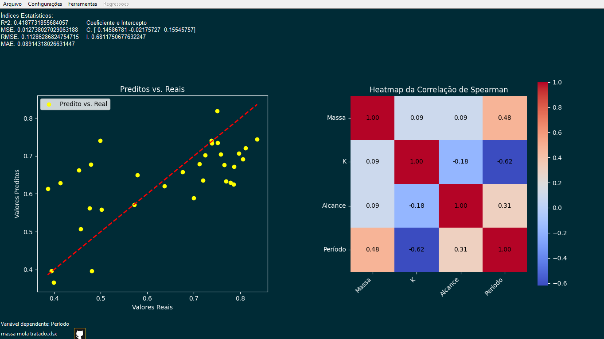

<a id="readme-top"></a>

<br />
<div align="center">
  <a href="https://github.com/CPCLLeffler/LabAI-CPCL">
    
  </a>

  <h3 align="center">CPCL-LabAI</h3>

  <p align="center">
    Um projeto inovador do Colégio Leffler para aplicar Machine Learning em sistemas físicos, facilitando o uso por pesquisadores e estudantes.
    <br />
    <br />
    <a href="https://github.com/CPCLLeffler/LabAI-CPCL/issues">Relatar um problema</a> ·
    <a href="https://github.com/CPCLLeffler/LabAI-CPCL/pulls">Contribuir</a>
  </p>
</div>

## Sobre o Projeto



O CPCL-LabAI é um software desenvolvido no Colégio Leffler, destinado a facilitar a análise de dados experimentais por meio de algoritmos de Machine Learning. O software foi projetado para ser intuitivo, permitindo que pesquisadores e estudantes, mesmo sem um profundo conhecimento técnico, possam utilizar poderosas ferramentas de machine learning para modelagem e previsão.

### Funcionalidades Principais:
- **Interface Gráfica Intuitiva (GUI)**: Facilita o uso para todos os níveis de habilidade.
- **Modelos de Machine Learning**: Implementação de regressões polinomiais, regressão linear, árvores de decisão, entre outros.
- **Análise e Visualização de Dados**: Geração de gráficos e análise preditiva de sistemas físicos.
- **Suporte a Dados Reais**: Validação usando experimentos reais, como o sistema massa-mola.

### Compilado com:
- [PyInstaller](https://github.com/pyinstaller/pyinstaller)


## Roadmap

- [ ] Adicionar botão para encontrar melhor \( R^2 \)
- [ ] Salvar modelos de regressão em arquivos
- [ ] Wiki na página do GitHub
- [ ] Suporte Multi-língua
  - [ ] Inglês
- [ ] Adicionar novos algoritmos de Machine Learning


## Como Usar

## Alternativa 1: Baixar o código fonte

### 1. **Clonar o Repositório**
Primeiro, clone o repositório para sua máquina local.

```bash
git clone https://github.com/CPCLLeffler/LabAI-CPCL.git
```
### 2. **Instalar os Requisitos**
```bash
pip install -r requirements.txt
```
### 3. **Executar o arquivo LabAI.py**

```bash
python LabAI.py
```
ou
```bash
python3 LabAI.py
```
## Alternativa 2: Baixar a versão já compilada

### Baixar as [builds não-experimentais](https://github.com/CPCLLeffler/LabAI-CPCL/releases)

### Build mais recente (GitHub Actions):
[Windows](https://nightly.link/CPCLLeffler/LabAI-CPCL/workflows/pyinstaller-workflow/main/LabAI-windows.zip)
[MacOS](https://nightly.link/CPCLLeffler/LabAI-CPCL/workflows/pyinstaller-workflow/main/LabAI-macos.zip)
[Ubuntu](https://nightly.link/CPCLLeffler/LabAI-CPCL/workflows/pyinstaller-workflow/main/LabAI-ubuntu.zip)

# OBSERVAÇÃO SOBRE A BUILD DE UBUNTU
Não sei se funciona em distros não baseadas em Debian. Vou providenciar builds para outras distribuições.

